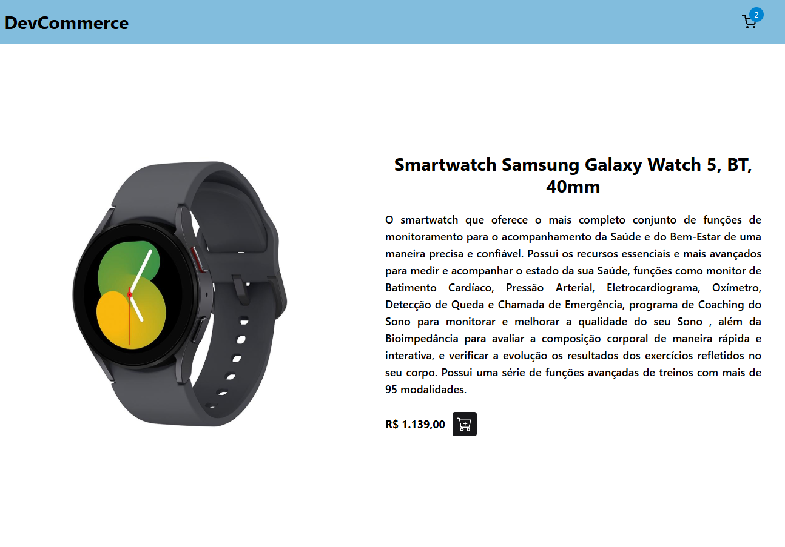
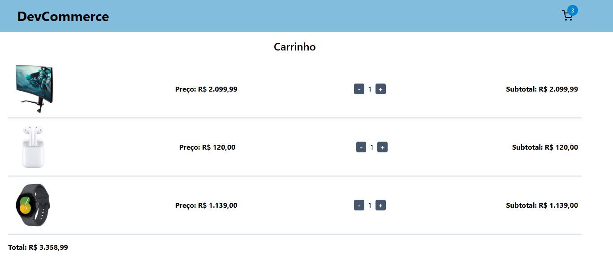

# DevCommerce

 E-commerce fictício apenas para fins acadêmicos e de aprendizado.
 Foi desenvolvido com **Vite**, **React**, **TypeScript**, **Tailwind CSS** e **Firebase**.  
 Acesse o projeto em produção aqui: [DevCommerce](https://dev-commerce-dun.vercel.app/)

---

## Visão geral

O DevCommerce é um app de loja virtual desenvolvido com React. Ele lista produtos buscados a partir de um banco de dados no Firebase, permite navegação entre páginas de produtos e carrinho de compras.

Este repositório serve como base acadêmica e demonstra conceitos como:

- Configuração de projeto com Vite;
- Estilização com Tailwind CSS;
- Criação de interfaces reativas com React e tipagem segura em TypeScript;
- Navegação SPA com React Router;
- Gerenciamento de estado;
- Consumo de dados do Firebase;

---

## Tecnologias

- ***Vite*** – Para desenvolvimento rápido e eficiente.
- ***React*** – Criar interfaces interativas e dinâmicas de forma eficiente;
- ***TypeScript*** – Adicionar tipagem estática melhorando segurança, produtividade e escalabilidade;
- ***Tailwind*** – Estilização rápida e eficiente;
- ***Firebase Firestore*** – Banco de dados NoSQL em nuvem flexível e escalável;
- ***React Router** – Criar aplicações *SPA* com navegação amigável e sem recarregamento de página
- ***React Toast*** e ***React Icons*** – Bibliotécas para melhorar a experiência do usuário;
  
---

##  Screenshots

Algumas capturas de tela para ilustrar diferentes estados do aplicativo:

### Página inicial

### Página Produto:

## Carrinho de compras:

---

## Melhorias e próximos passos

- Implementar autenticação com Firebase Auth (login/registro)
- Integração com APIs de pagamento (ex: Stripe)
- Painel de administração para gerenciamento de produtos
- Filtros por categoria, preço e avaliação
- Testes unitários com Jest ou Vitest

---

##  Contato

Construído por **Gilberto Xavier**.

[LinkedIn](https://www.linkedin.com/in/gilbertosx/)

[Email](mailto:gilbertosxavier@live.com)
